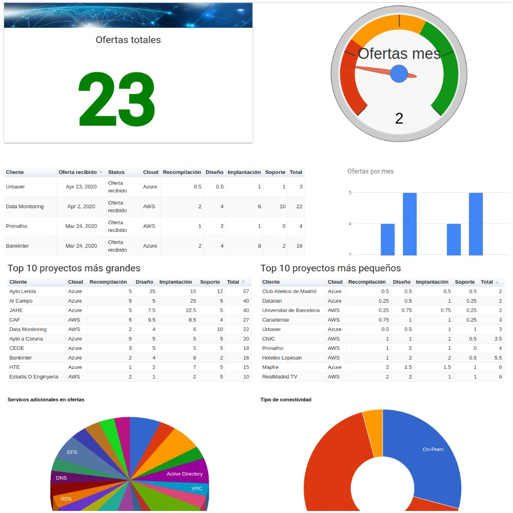
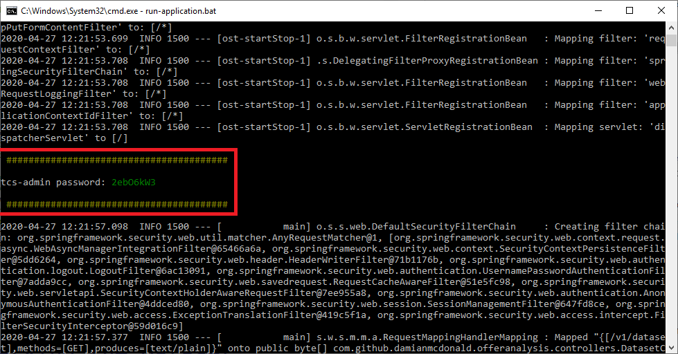

# Offer Analysis


Offer Analysis is a web application which provides an analysis dashboard and an interactive query environment. The dataset for the application is a CSV file.

The application is packaged as a Java application ([Spring Boot executable jar](https://docs.spring.io/spring-boot/docs/current/reference/html/appendix-executable-jar-format.html)) and uses 3rd party open source JavaScript libraries for the charting and querying functionalities.



# Grab the code

This section describes the process to clone the code base and build the project using the Java JDK 8 and Maven tool chain.

```bash
git clone https://oauth2:<personal-access-token>@code.fresco.me/mvp-cloud-spain/offer-analysis.git offer-analysis
cd offer-analysis
mvn clean package
```

# Run the project

To run the project, do the following:

1. Modify the settings in the [application.properties](src/main/resources/application.properties) file to suit your needs
2. Build the binary; `mvn clean package`
3. Execute the `run-application` startup script for your environment (`.sh` for linux or `.bat` for windows)
4. The `offer-analysis` application will launch and be available on the `server.port` value that you specified in the `application.properties` file. For example, http://localhost:9923
5. You can login as a standard user using the credentials specified in the `user.standard.name` and `user.standard.password` values of the `application.properties` file.
6. If you wish to logon as an admin user, which will allow you to view the full set of [actuator metrics](https://docs.spring.io/spring-boot/docs/current/reference/html/production-ready-features.html), you must use the username specified in the `user.admin.name` value of the `application.properties` file. For the password, you will need to scroll through the console/log file output of the application in order to find the administrator password block (as illustrated below).



# Dataset schema

`offer-analysis` creates charts, dadhboards and queries based on a dataset that is defiined in CSV format.

The structure of the dataset is defined below:

| Field name  | Position  | Type | Example | Description |
| -------- | -------- | -------- | -------- | -------- |
| client | 1 | String | Mapfre | Name of the client |
| status | 2 | String | OFFER_RECEIVED | Enum of offer status; OFFER_RECEIVED, COMPLETE, IN_PROGRESS, ACCEPTED | 
| statusDate | 3 | String | 2020-04-27 | Date of offer using [JavaScript ISO 8601](https://www.w3schools.com/js/js_date_formats.asp) date format. | 
| cloud | 4 | String | AWS | Enum of cloud providers; AWS, Azure, GCP |
| greenfield | 5 | Boolean | TRUE | Indicates if the offer is for a Greenfield installation |
| regions | 6 | Number | 1 | Number of cloud regions considered in the offer |
| accounts | 7 | Number | 1 | Number of cloud accounts considered in the offer |
| applications | 8 | Number | 1 | Number of applications to be migrated in the offer |
| vpcs | 9 | Number | 1 | Number of vpcs considered in the offer |
| subnets | 10 | Number | 1 | Number of subnets considered in the offer |
| hasConnectivity | 11 | Boolean | TRUE | Indicates if the offer requires On-Premises connectivity |
| hasPeerings | 12 | Boolean | TRUE | Indicates if the offer requires VPC Peerings |
| hasDirectoryService | 13 | Boolean | TRUE | Indicates if the offer requires a directory service (Active Directory or LDAP) |
| hasAdvancedSecurity | 14 | Boolean | TRUE | Indicates if the offer requires advanced security group and NACL configuration |
| hasAdvancedLogging | 15 | Boolean | TRUE | Indicates if the offer requires advanced logging configuration |
| hasAdvancedMonitoring | 16 | Boolean | TRUE | Indicates if the offer requires advanced monitoring configuration |
| hasAdvancedBackup | 17 | Boolean | TRUE | Indicates if the offer requires advanced backup configuration |
| virtualMachines | 18 | Number | 1 | Number of virtual machines to be included in the offer |
| buckets | 19 | Number | 1 | Number of object storage instances to be included in the offer |
| databases | 20 | Number | 1 | Number of PaaS databases to be included in the offer |
| hasELB | 21 | Boolean | TRUE | Indicates if the offer requires a Load Balancer |
| hasAutoScripts | 22 | Boolean | TRUE | Indicates if the offer requires automation scripts (CloudFormation, ARM, Terraform) |
| hasOtherServices | 23 | Boolean | TRUE | Indicates if the offer requires additional services that can not be auto-estimated by the Day Calculator |
| service1 | 24 | String | Elastic Beanstalk | Name of the additional service |
| service2 | 25 | String | Route 53 | Name of the additional service |
| service3 | 26 | String | Bastion | Name of the additional service |
| service4 | 27 | String | Active Directory | Name of the additional service |
| service5 | 28 | String | App Service | Name of the additional service |
| phase1EstimatePre | 29 | Number | 0.5 | Estimate generated by the Day Calculator for the recompilación phase |
| phase1Estimate| 30 | Number | 1 | Estimate generated by Architects for the recompilación phase |
| phase1Deviation | 31 | Number | 1 | The degree of deviation between the Day Calculator estimate and the Architects estimate for the recompilación phase |
| phase2EstimatePre | 32 | Number | 0.5 | Estimate generated by the Day Calculator for the diseño phase |
| phase2Estimate| 33 | Number | 1 | Estimate generated by Architects for the diseño phase |
| phase2Deviation | 34 | Number | 1 | The degree of deviation between the Day Calculator estimate and the Architects estimate for the diseño phase |
| phase3EstimatePre | 35 | Number | 0.5 | Estimate generated by the Day Calculator for the implantación phase |
| phase3Estimate| 36 | Number | 1 | Estimate generated by Architects for the implantación phase |
| phase3Deviation | 36 | Number | 1 | The degree of deviation between the Day Calculator estimate and the Architects estimate for the implantación phase |
| phase4EstimatePre | 37 | Number | 0.5 | Estimate generated by the Day Calculator for the soporte phase |
| phase4Estimate| 38 | Number | 1 | Estimate generated by Architects for the soporte phase |
| phase4Deviation | 39 | Number | 1 | The degree of deviation between the Day Calculator estimate and the Architects estimate for the soporte phase |
| totalPre | 40 | Number | 0.5 | Total estimate generated by the Day Calculator |
| total| 41 | Number | 1 | Total estimate generated by Architects |
| totalDeviation | 42 | Number | 1 | The degree of deviation between the Day Calculator estimate and the Architects estimate for the total offer |
| travel | 43 | Number | 0 | Number of travel days to the client premises included in the offer |
| administered | 44 | Boolean | TRUE | Indicates if the offer will be administered |
| geoLocation | 45 | String | Madrid | Name of the city where the client is situated |
| isValid | 46 | Boolean | TRUE | Indicates if the criteria of the offer fits within the constraints of the Day Calculator |

The application allows you to use an embedded dataset or an external dataset.

To use the embedded dataset, you must set `dataset.embedded=true` in the `application.properties` file. The embedded dataset is located at [src/main/resources/static/assets/data/dataset.csv](src/main/resources/static/assets/data/dataset.csv).

If you wish to use an external data set, you must set `dataset.embedded=false` and the absolute path to the external dataset `dataset.filepath=/opt/data/mydataset.csv` in the `application.properties` file.

# Querying the dataset

Once the CSV dataset is loaded into the application, it becomes a JSON data model.

The structure of the JSON data model is provided below:

```javascript
{
  "client": "Globalia Web",                         // client name
  "status": "Oferta recibido",                      // Oferta recibido / Aceptado / Completado / En marcha
  "statusDate": "2019-12-18T00:00:00.000Z",         // complete date
  "statusDateYYYY": "1970-01-01T00:00:02.019Z",     // date as year
  "statusDateYYYYMM": "2019-12-01T00:00:00.000Z",   // date as year and month
  "statusDateTimestamp": 1576627200000,             // date as timestamp
  "cloud": "AWS",                                   // AWS / Azure / GCP
  "greenfield": false,                              // is greenfield?
  "regions": 1,                                     // # of regions
  "accounts": 1,                                    // # of accounts
  "applications": 0,                                // # of applications
  "vpcs": 2,                                        // # of vpcs
  "subnets": 2,                                     // # of subnets
  "hasConnectivity": true,                          // has ON-Prem connecitivty?; VPN or Dedicated Connection
  "hasPeerings": true,                              // has a VPC peering?
  "hasDirectoryService": false,                     // has Active Directory or LDAP?
  "hasAdvancedSecurity": false,                     // has advanced security group / NACL configuration?
  "hasAdvancedLogging": false,                      // has advanced logging configuration?
  "hasAdvancedMonitoring": true,                    // has advanced monitoring configuration?
  "hasAdvancedBackup": false,                       // has advanced backup configuration?
  "virtualMachines": 5,                             // # of virtual machines
  "buckets": 2,                                     // # of object storage instances
  "databases": 0,                                   // # of PaaS databases
  "hasElb": false,                                  // has a Load Balancer?
  "hasAutoScripts": true,                           // has IaC automation scripts?
  "hasOtherServices": true,                         // has other services which don't fit in the day calculator?
  "service1": "VPC",                                // additional service 1 name
  "service2": "CloudWatch",                         // additional service 2 name
  "service3": "CloudTrail",                         // additional service 3 name
  "service4": "Config",                             // additional service 4 name
  "service5": "SNS",                                // additional service 5 name
  "phase1EstimatePre": 1.5,                         // phase 1 pre-estimation by day calculator
  "phase1Estimate": 1.5,                            // phase 1 estimation by architects
  "phase1Deviation": 0,                             // phase 1 deviation between day calculator and architects
  "phase2EstimatePre": 3,                           // phase 2 pre-estimation by day calculator
  "phase2Estimate": 2,                              // phase 2 estimation by architects
  "phase2Deviation": 1,                             // phase 2 deviation between day calculator and architects
  "phase3EstimatePre": 4.5,                         // phase 3 pre-estimation by day calculator
  "phase3Estimate": 3.25,                           // phase 3 estimation by architects
  "phase3Deviation": 1.25,                          // phase 3 deviation between day calculator and architects
  "phase4EstimatePre": 1.25,                        // phase 4 pre-estimation by day calculator
  "phase4Estimate": 1.25,                           // phase 4 estimation by architects
  "phase4Deviation": 0,                             // phase 4 deviation between day calculator and architects
  "totalPre": 10.25,                                // total pre-estimation by day calculator
  "total": 8,                                       // total estimation by architects
  "totalDeviation": 2.25,                           // total deviation between day calculator and architects
  "travel": 2,                                      // # of trips to client premises
  "administered": false,                            // administered?
  "geoLocation": "Palma de Mallorca",               // location of client
  "isValid": true                                   // does this offer fit within the constraints of the daya calculator?
}
```

This JSON dataset can be queried in real-time using standard SQL syntax.

This querying functionality can be accessed via the **Query** option from the application index.

**NOTE**: The *database* referenced in the `FROM` clause is always represented as `?`

Below are some example queries to get you started:

Show me:

+ offers between Jan 2020 and Mar 2020
+ cloud is AWS
+ total duration of project is greater then 5 days
+ total number of virtual machine included in the offer is greater than 2

```sql
SELECT client, cloud, total, virtualMachines, geoLocation
FROM ?
WHERE statusDate > DATE('2020-01') AND statusDate < DATE('2020-04')
AND cloud = "AWS"
AND total>= 5
AND virtualMachines > 2
```

Show me:

+ offers that are greenfield
+ cloud is Azure
+ client is not situated in Madrid

```sql
SELECT *
FROM ?
WHERE greenfield = true
AND cloud = "Azure"
AND geoLocation != "Madrid"
```

Show me:

+ top 10 offers sorted by largest duration

```sql
SELECT client, cloud, statusDate, total
FROM ?
ORDER BY totalDESC
LIMIT 10
```