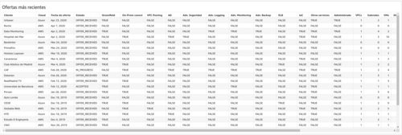

## Create the QuickSight dataset

1. Logon to QuickSight
2. Click *Manage data*
3. Click *New data set*
4. Click *Upload a file*
5. Choose a `csv` dataset
6. Click *Next*
7. Click *Edit/Preview data*

## Add calculated fields

Some calculated fields can be added *during* the data preparation phase.

### Add the target for the monthly offers gauge visualization
1. Click *Add calculated field*
2. In *Calculated field name* enter `target_monthly_offers`
3. In *Formula* enter `ceil(8)` - where 8 is the monthly target number
4. Click `Create`

### Add the truncated status date in order to show visualizations per month
1. Click *Add calculated field*
2. In *Calculated field name* enter `status_date_yyyy_mm`
3. In *Formula* enter `truncDate("MM", statusDate)`
4. Click `Create`

### Save & visualize
1. Click *Save & visualize*

## Create some visualizations

### Total offers (Key Performance Indicator (KPI))

1. Click `Add`
2. Click `Add visual`
3. In *Visual types* click `Key Performance Indicator (KPI)`
4. In *Field wells*, drag `client` field to *Value* in the *Field wells*
5. The *Value* should appear as `client(Count)`
6. Click *Format visual* and change the *Primary value font size* to `Extra large`
7. Update the title of the visual; `Ofertas totales` and change the *Title font size* to `Extra large`

### Monthly offers (Gauge chart)

1. Click `Add`
2. Click `Add visual`
3. In *Visual types* click `Gauge chart`
4. In *Field wells*, drag `client` field to *Value* in the *Field wells*
5. The *Value* should appear as `client(Count)`
6. In *Field wells*, drag `target_monthly_offers` field to *Target value* in the *Field wells*
7. Click the *down-arrow* on `target_monthly_offers`, click `Aggregate` -> `Min`
8. Click *Filter* and click `Create one`
9. Choose `status_date_yyyy_mm`
10. Filter type:
  - `Relative dates`
  - `Months`
  - `This month`
  - `Exclude nulls`
11. Click `Apply`
12. Update the title of the visual; `Ofertas realizadas este mes` and change the *Title font size* to `Extra large`
13. Change the *Data labels Font size* to `Extra large`

### Offers per month (Line chart)

1. Click `Add`
2. Click `Add visual`
3. In *Visual types* click `Line chart`
4. In *Field wells*, drag `status_date_yyyy_mm` field to *Value* in the *Field wells*
6. Click *Format visual* and change the *Primary value font size* to `Extra large`
7. Click *X-Axis* and change the label *status_date_yyyy_mm* to `Meses`
8. Click *Y-Axis*, tick *Show Y-Axis label* and add the label `# ofertas`
9. Update the title of the visual; `# ofertas por mes` and change the *Title font size* to `Extra large`

### Offer statuses (Vertical bar chart)

1. Click `Add`
2. Click `Add visual`
3. In *Visual types* click `Vertical bar chart`
4. In *Field wells*, drag `status` field to *Value* in the *Field wells*
6. Click *Format visual* and change the *Primary value font size* to `Extra large`
7. Click *X-Axis* and change the label *status* to `Estados`
8. Click *Y-Axis*, tick *Show Y-Axis label* and add the label `# ofertas`
9. Update the title of the visual; `Estados por oferta` and change the *Title font size* to `Extra large`

### Most recent offers (Table)

1. Click `Add`
2. Click `Add visual`
3. In *Visual types* click `Table`
4. In *Field wells*, drag `client`, `cloud`, `statusDate`, `status` fields to *Group by* in the *Field wells*
5. In *Field wells*, drag `phase1Estimate`, `phase2Estimate`, `phase3Estimate`, `phase4Estimate`, `total` fields to *Value* in the *Field wells*
6. Click the *down-arrow* on each field in *Value* and ensure; `Aggregate` -> `Min`
7. Click *Format visual*, go to *Group-by column names* and name the columns as follows;
  - *client* -> `Cliente`
  - *cloud* -> `Cloud`
  - *statusDate* -> `Fecha de oferta`
  - *status* -> `Estado`
8. Go to *Value column names* and name the columns as follows;
  - *phase1Estimate* -> `Recopilación`
  - *phase2Estimate* -> `Diseño`
  - *phase3Estimate* -> `Implantación`
  - *phase4Estimate* -> `Soporte`
  - *total* -> `Total`
9. Update the title of the visual; `Ofertas más recientes` and change the *Title font size* to `Extra large`

### Distribution by cloud (Pie chart)

1. Click `Add`
2. Click `Add visual`
3. In *Visual types* click `Pie chart`
4. In *Field wells*, drag `cloud` field to *Group/Color* in the *Field wells*
5. Click *Format visual* and change *Data labels*:
  - Tick *Show data labels*
  - Tick *Show category*
  - Tick *Show metric*
  - Add metric text as `Cloud`
6. Go to *Legend* and set legend text as `Cloud`
7. Update the title of the visual; `Distribución por Cloud Provider` and change the *Title font size* to `Extra large`

### Distribution by connectivity (Donut chart)

1. Click `Add`
2. Click `Add visual`
3. In *Visual types* click `Donut chart`
4. In *Field wells*, drag `hasConnectivity` field to *Group/Color* in the *Field wells*
5. Click *Format visual* and change *Data labels*:
  - Tick *Show data labels*
  - Tick *Show category*
  - Tick *Show metric*
  - Add metric text as `Conectividad`
6. Go to *Legend* and set legend text as `Greenfield`
7. Update the title of the visual; `Distribución de conectividad On-Prem` and change the *Title font size* to `Extra large`

### Distribution by client location (Word cloud)

1. Click `Add`
2. Click `Add visual`
3. In *Visual types* click `Word cloud`
4. In *Field wells*, drag `geoLocation` field to *Group by* in the *Field wells*
5. Update the title of the visual; `Distribución de ubicaciones de clientes` and change the *Title font size* to `Extra large`
