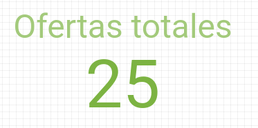
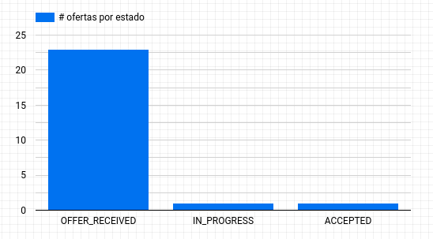
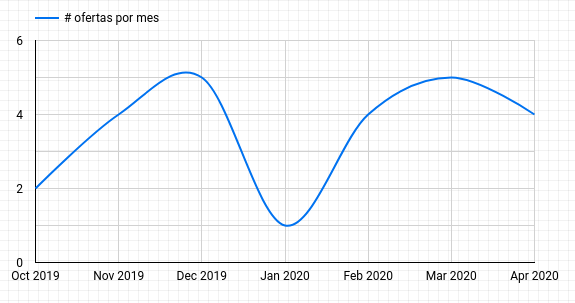
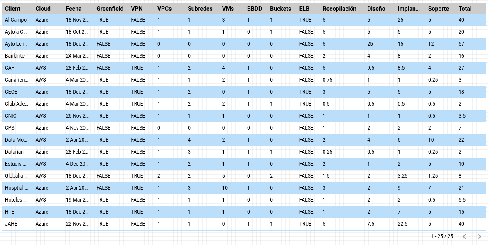
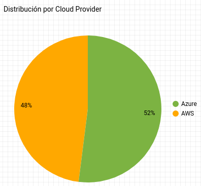
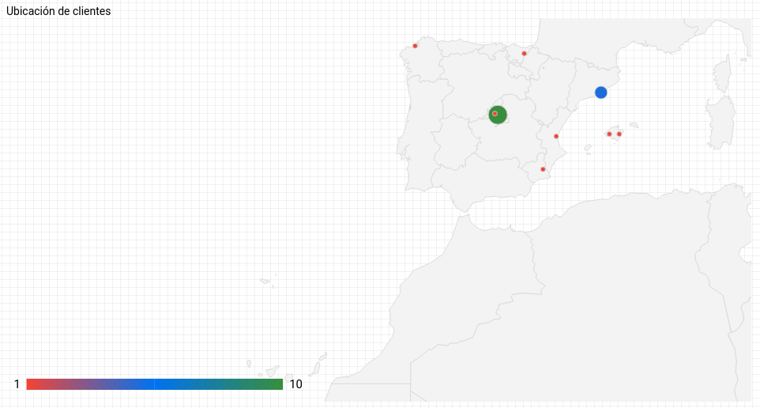

## Create the Data Studio dataset

1. Logon to Data Studio
2. Create a new report
3. In the *Add data to report* select `File Upload`
5. Choose a `csv` dataset
6. Click *Add*
7. Click *Add to Report*

## Add calculated fields

Add calculated fields after the initial data upload.

### Open the managed data source
1. Go to *Resource* menu
2. Choose *Manage added data sources*
3. Choose to *Edit* the `csv` dataset

### Change the `geoLocation` from Text to a *Geo* -> *Town/City*
1. Find the field `geoLocation`
2. Click the *Text* type in order to change the type
3. Select *Geo* -> *Town/City*
4. Click *Continue*

### Add the truncated status date in order to show visualizations per month
1. Click the three dots next to field `statusDate`
2. Choose duplicate
3. Find the `Copy of statusDate` and rename if to `status_date_yyyy_mm`
4. Choose the *Type* and change it to `Date and time` -> `Year Month (YYYYMM)`
5. Click `Finished`
6. Click `Close`

## Create some visualizations

### Quarterly offers (Scorecard)

1. Click `Insert` -> `Scorecard`
2. Draw the `Scorecard` on the canvas
3. In *Date Range Dimension* add `statusDate`
4. In *Metric* add `Record Count` with `Auto` aggregation
5. In *Default date range* select `Custom`
6. In *Auto date range* select `This quarter to date`

### Offer states (Bar chart)

1. Click `Insert` -> `Bar chart`
2. Draw the `Bar chart` on the canvas
3. In *Metric* add `status`
4. In *Zoom area* choose `Spain`

### Offers per month (Time series)

1. Click `Insert` -> `Time series`
2. Draw the `Time series` on the canvas
3. In *Date Range Dimension* add `status_date_yyyy_mm`
4. In *Dimension* add `status_date_yyyy_mm`
5. In *Metric* add `client` with `Count Distinct` aggregation

### Tabular data (Table)

1. Click `Insert` -> `Table`
2. Draw the `Table` in the canvas
3. In *Date Range Dimension* add `statusDate`
4. In *Dimension* add `hasAdvancedMonitoring`
5. In *Metric* add `Record Count`

### Distribution by Cloud Provider (Pie chart)

1. Click `Insert` -> `Pie chart`
2. Draw the `Pie chart` on the canvas
3. In *Date Range Dimension* add `statusDate`
4. In *Dimension* add `cloud`
5. In *Metric* add `Record Count`
6. In *Sort* add `Record Count`

### Client locations (Geo map)

1. Click `Insert` -> `Geo map`
2. Draw the `Geo map` on the canvas
3. In *Geo dimension* add `geoLocation`
4. In *Zoom area* choose `Spain`
